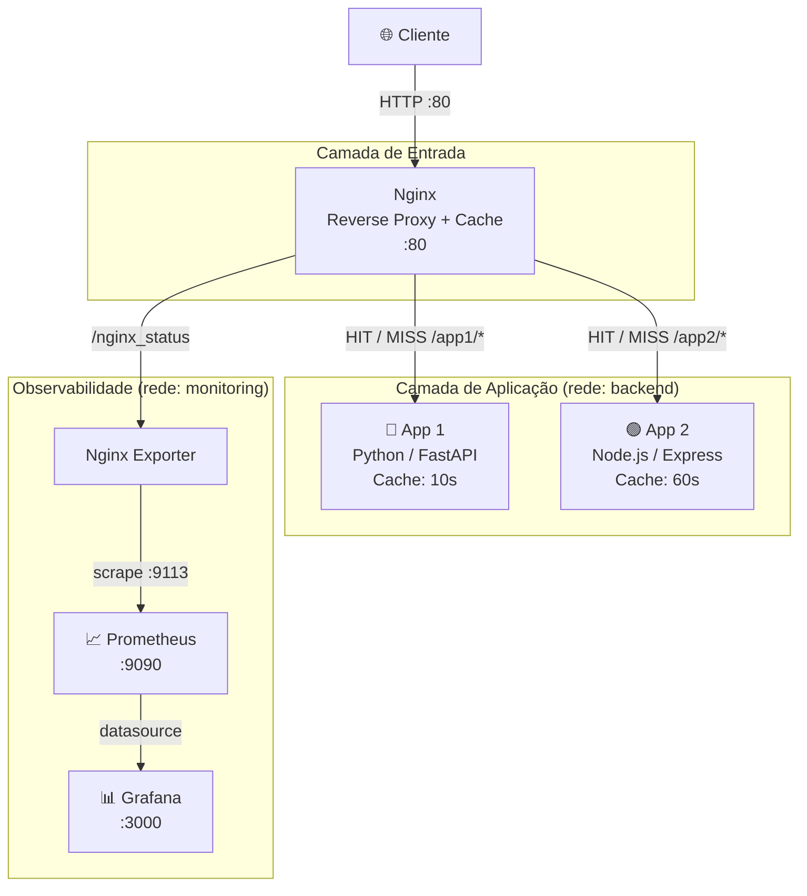
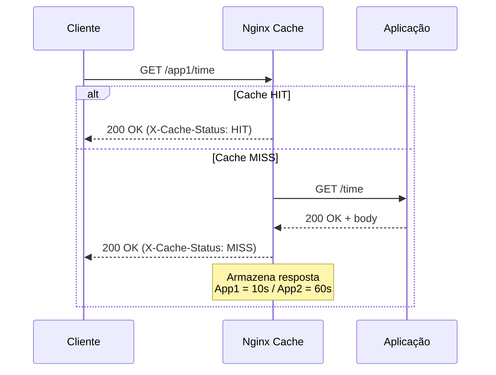
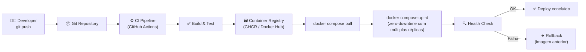
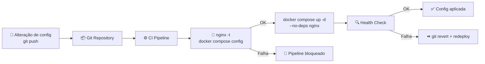

# Arquitetura da Infraestrutura

## Visão Geral dos Componentes

| Componente        | Tecnologia                       | Porta (externa) |
|-------------------|----------------------------------|-----------------|
| App 1             | Python 3.12 / FastAPI            | — (interno)     |
| App 2             | Node.js 20 / Express             | — (interno)     |
| Reverse Proxy     | Nginx (+ Proxy Cache)            | **80**          |
| Nginx Exporter    | nginx-prometheus-exporter        | — (interno)     |
| Métricas          | Prometheus                       | **9090**        |
| Dashboards        | Grafana                          | **3000**        |

---

## Diagrama de Componentes

---

## Fluxo de Requisição (com Cache)

---

## Fluxo de Atualização

### Código das Aplicações

### Infraestrutura (nginx.conf, docker-compose.yml)

---

## Análise e Pontos de Melhoria

### Pontos fortes da arquitetura atual

- **Cache no proxy**: o Nginx absorve carga sem modificar o código das aplicações
- **Headers de debug**: `X-Cache-Status` e `X-Cache-TTL` em todas as respostas
- **Redes separadas**: `backend` (apps ↔ nginx) e `monitoring` (observabilidade) isoladas
- **Health checks**: todos os serviços possuem verificação de saúde
- **Execução em 1 comando**: `docker compose up -d` ou `make up`

### Sugestões de Melhoria

| # | Melhoria | Justificativa |
|---|----------|---------------|
| 1 | **Kubernetes (K8s)** | HPA para escalonamento automático, rolling updates nativos e self-healing |
| 2 | **Redis como cache distribuído** | Permite cache compartilhado entre múltiplas réplicas das apps; persistência e TTL granular por chave |
| 3 | **CI/CD completo** | GitHub Actions para build → test → push → deploy automático a cada `git push` |
| 4 | **HTTPS / TLS** | Certbot + Let's Encrypt via Nginx ou Traefik como ingress; obrigatório em produção |
| 5 | **Múltiplas réplicas** | Load balancing com `deploy.replicas` no Compose ou Deployment no K8s |
| 6 | **Distributed Tracing** | OpenTelemetry + Jaeger para rastrear latência ponta a ponta e correlacionar logs |
| 7 | **Centralização de logs** | Loki + Promtail + Grafana (stack PLG) para consultas e alertas sobre logs |
| 8 | **Rate Limiting** | `limit_req_zone` no Nginx para proteção contra DDoS / abuso |
| 9 | **Resource Limits** | `mem_limit` / `cpus` no Compose (ou `resources.limits` no K8s) para evitar noisy neighbor |
| 10 | **Secrets Management** | Docker Secrets ou HashiCorp Vault — nunca variáveis de ambiente em texto claro |
| 11 | **Alerting** | Alertmanager (Prometheus) + notificações Slack/PagerDuty para SLO/SLA |
| 12 | **Cache Warming** | Script de pré-aquecimento do cache após deploy para evitar spike de MISS |
