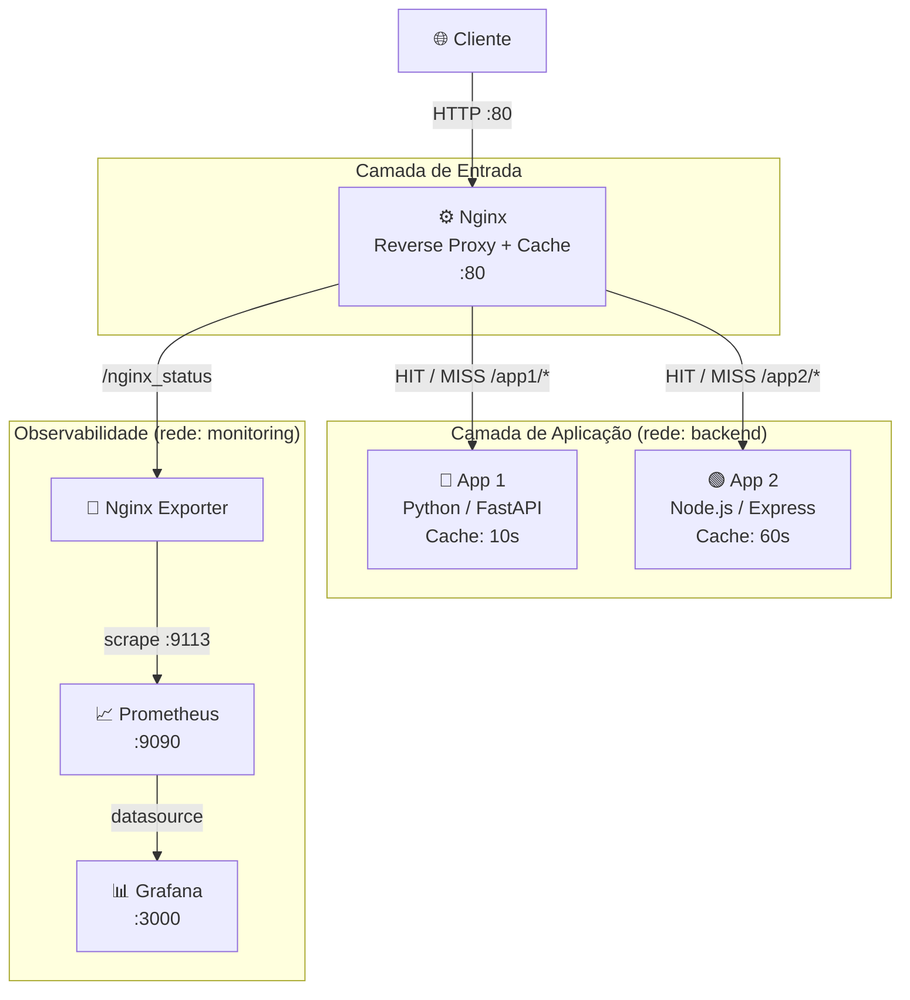
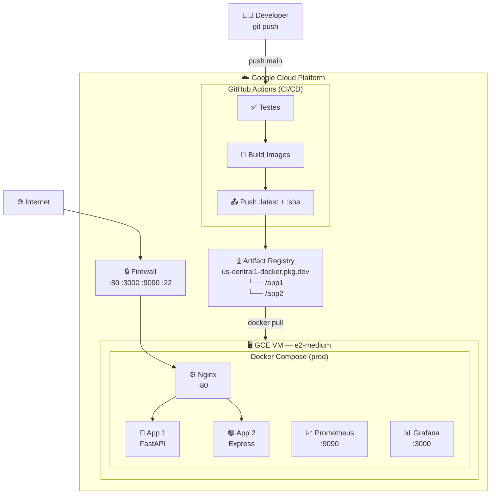
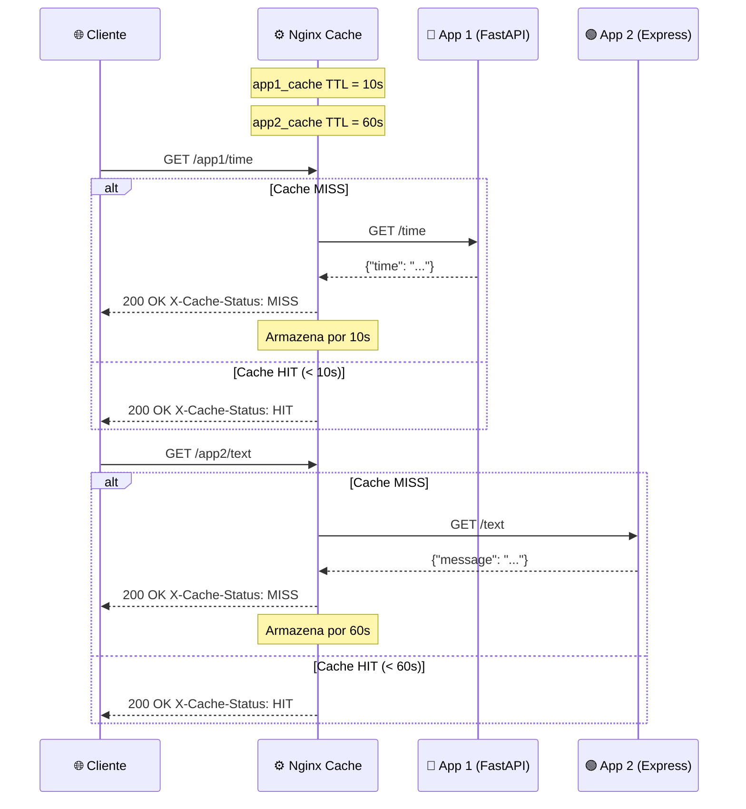
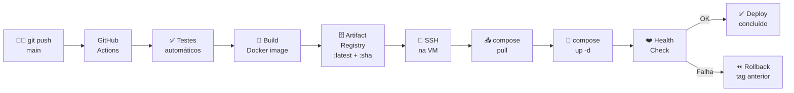
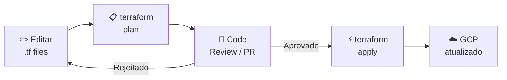
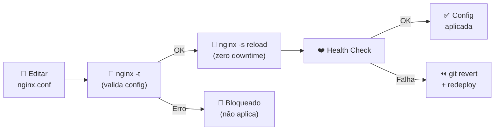

# Arquitetura — Desafio DevOps 2025

---

## 1. Visão Geral dos Componentes

| Componente        | Tecnologia                       | Porta (externa) |
|-------------------|----------------------------------|-----------------|
| App 1             | Python 3.12 / FastAPI            | — (interno)     |
| App 2             | Node.js 20 / Express             | — (interno)     |
| Reverse Proxy     | Nginx (+ Proxy Cache)            | **80**          |
| Nginx Exporter    | nginx-prometheus-exporter        | — (interno)     |
| Métricas          | Prometheus                       | **9090**        |
| Dashboards        | Grafana                          | **3000**        |

---

## 2. Diagrama Local (Docker Compose)

---

## 3. Diagrama de Produção (GCP)

---

## 4. Fluxo de Requisição (com Cache)

---

## 5. Fluxo de Atualização

### 5.1 — Código das Aplicações (CI/CD automatizado)

### 5.2 — Infraestrutura (Terraform)

### 5.3 — Config Nginx (sem downtime)

---

## 6. Análise e Pontos de Melhoria

### Pontos fortes da arquitetura atual

- ✅ Cache centralizado no Nginx sem modificar código das apps
- ✅ TTLs diferentes por serviço (`app1_cache: 10s` / `app2_cache: 60s`)
- ✅ Headers `X-Cache-Status` e `X-Cache-TTL` em todas as respostas (debug fácil)
- ✅ Redes Docker separadas (`backend` / `monitoring`)
- ✅ Health checks em todos os containers
- ✅ IaC com Terraform — infra versionada e reproduzível
- ✅ CI/CD automatizado com GitHub Actions (test → build → push → deploy)
- ✅ Imagens versionadas por SHA do commit no Artifact Registry

---

### Sugestões de Melhoria

| # | Melhoria | Impacto | Esforço |
|---|----------|:-------:|:-------:|
| 1 | **Kubernetes (GKE)** — HPA, rolling updates, self-healing | 🔴 Alto | 🔴 Alto |
| 2 | **Cloud Load Balancer** — GLB gerenciado em vez de IP direto da VM | 🔴 Alto | 🟡 Médio |
| 3 | **HTTPS / TLS** — Managed Certificate no GCP ou Let's Encrypt | 🔴 Alto | 🟢 Baixo |
| 4 | **Redis como cache distribuído** — cache entre múltiplas réplicas, TTL por chave | 🟡 Médio | 🟡 Médio |
| 5 | **Múltiplas réplicas + LB** — escalar app1/app2 horizontalmente | 🔴 Alto | 🟡 Médio |
| 6 | **Cloud Armor** — WAF + proteção contra DDoS | 🔴 Alto | 🟡 Médio |
| 7 | **OpenTelemetry + Jaeger** — distributed tracing ponta a ponta | 🟡 Médio | 🟡 Médio |
| 8 | **Loki + Promtail + Grafana** — agregação centralizada de logs | 🟡 Médio | 🟢 Baixo |
| 9 | **Terraform remote state (GCS)** — estado compartilhado em Cloud Storage | 🔴 Alto | 🟢 Baixo |
| 10 | **Resource limits** — CPU/Memory limits nos containers | 🟡 Médio | 🟢 Baixo |
| 11 | **Alertas Grafana/Alertmanager** — notificar no Slack se cache hit rate cair | 🟡 Médio | 🟢 Baixo |
| 12 | **GCP Secret Manager** — credenciais via secret manager em vez de env vars | 🔴 Alto | 🟢 Baixo |

---

## 7. Estimativa de Custo Mensal (GCP — us-central1)

| Recurso | Configuração | Custo estimado/mês |
|---------|-------------|-------------------:|
| GCE VM | e2-medium 24/7 | ~$27,00 |
| Artifact Registry | 1 GB storage | ~$0,10 |
| Egress de rede | ~10 GB | ~$1,20 |
| **Total estimado** | | **~$28/mês** |

> 💡 Com os **$1.700 de créditos** da conta de testes GCP, a infraestrutura tem aproximadamente **5 anos** de operação contínua.
