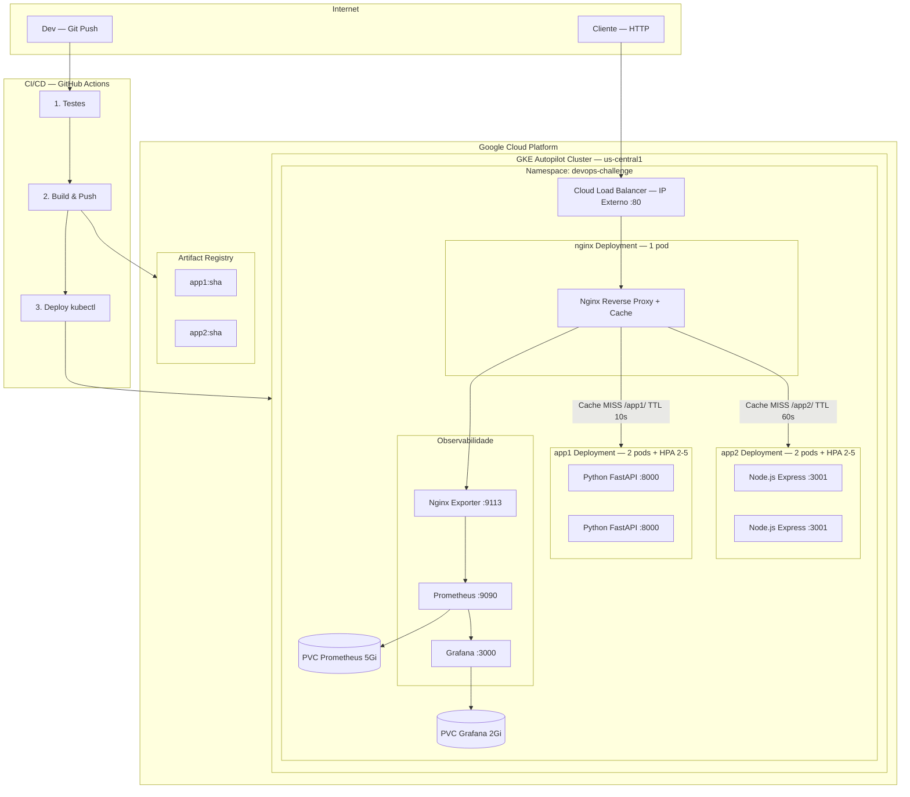
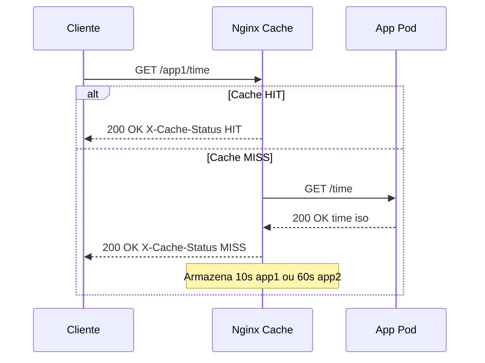
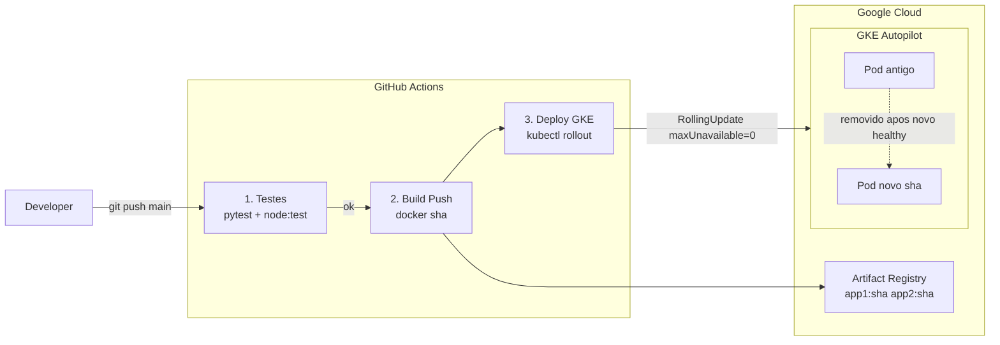

# Arquitetura da Infraestrutura

## Visão Geral

A infraestrutura roda no **Google Kubernetes Engine (GKE Autopilot)** na região `us-central1`.
O Nginx atua como reverse proxy e camada de cache, exposto via **Cloud Load Balancer**.
As imagens são armazenadas no **Artifact Registry** e o deploy é automatizado via **GitHub Actions**.

---

## Diagrama — Arquitetura GKE

---

## Diagrama — Fluxo de Requisicao com Cache

---

## Diagrama — Fluxo de Atualizacao CI/CD

> **RollingUpdate com maxUnavailable 0** garante zero downtime.
> O pod novo sobe, passa no readinessProbe, e so entao o pod antigo e removido.

---

## Componentes e Responsabilidades

| Componente | Tecnologia | Tipo K8s | Replicas | Porta |
|------------|-----------|----------|----------|-------|
| App 1 | Python FastAPI | Deployment | 2-5 HPA | 8000 |
| App 2 | Node.js Express | Deployment | 2-5 HPA | 3001 |
| Nginx proxy+cache | nginx:alpine | Deployment | 1 | 80 |
| Nginx Exporter | nginx-prometheus-exporter | Deployment | 1 | 9113 |
| Prometheus | prom/prometheus | Deployment | 1 | 9090 |
| Grafana | grafana/grafana | Deployment | 1 | 3000 |

---

## Cache — Configuracao

| App | Cache Zone | TTL | Header de resposta |
|-----|-----------|-----|--------------------|
| App 1 | app1_cache 10MB | **10 segundos** | X-Cache-Status: HIT ou MISS |
| App 2 | app2_cache 10MB | **1 minuto** | X-Cache-Status: HIT ou MISS |

---

## Analise e Sugestoes de Melhoria

### Pontos fortes da arquitetura atual

- GKE Autopilot — Google gerencia os nodes, escala sem configuracao manual
- Rolling Update com zero downtime — maxUnavailable 0 garante disponibilidade
- HPA — escala pods de app1 e app2 baseado em CPU e memoria
- Cache no proxy — sem alterar codigo das apps, TTLs diferentes por servico
- Imutabilidade de imagem — cada deploy usa o SHA exato do commit
- Testes no CI — bloqueia deploy se os testes falharem
- Observabilidade — Prometheus coleta metricas, Grafana exibe dashboards
- PersistentVolumeClaims — dados sobrevivem a restarts de pods

### Sugestoes de melhoria

| # | Melhoria | Justificativa |
|---|----------|---------------|
| 1 | Helm Charts | Parametrizar manifests e gerenciar releases com rollback |
| 2 | Ingress + cert-manager | HTTPS automatico via Lets Encrypt, elimina LoadBalancer por servico |
| 3 | Workload Identity Federation | Autenticacao GCP sem chave JSON no CI |
| 4 | Kubernetes Secrets | Mover senhas para Secret em vez de env plain |
| 5 | Redis como cache distribuido | Cache persiste entre restarts e compartilhado entre replicas nginx |
| 6 | Cloud Armor | WAF e protecao DDoS na frente do Load Balancer |
| 7 | Cloud CDN | Cache na borda global para conteudo estatico |
| 8 | Loki + Grafana | Centralizar logs dos pods junto as metricas |
| 9 | OpenTelemetry | Distributed tracing entre nginx e apps |
| 10 | Multi-region | Cluster em multiplas regioes com Cloud DNS para failover global |
| 11 | ArgoCD ou Flux | GitOps — cluster observa o repo e aplica changes automaticamente |
| 12 | VPC privada | Apps em subrede privada, apenas nginx exposto publicamente |
