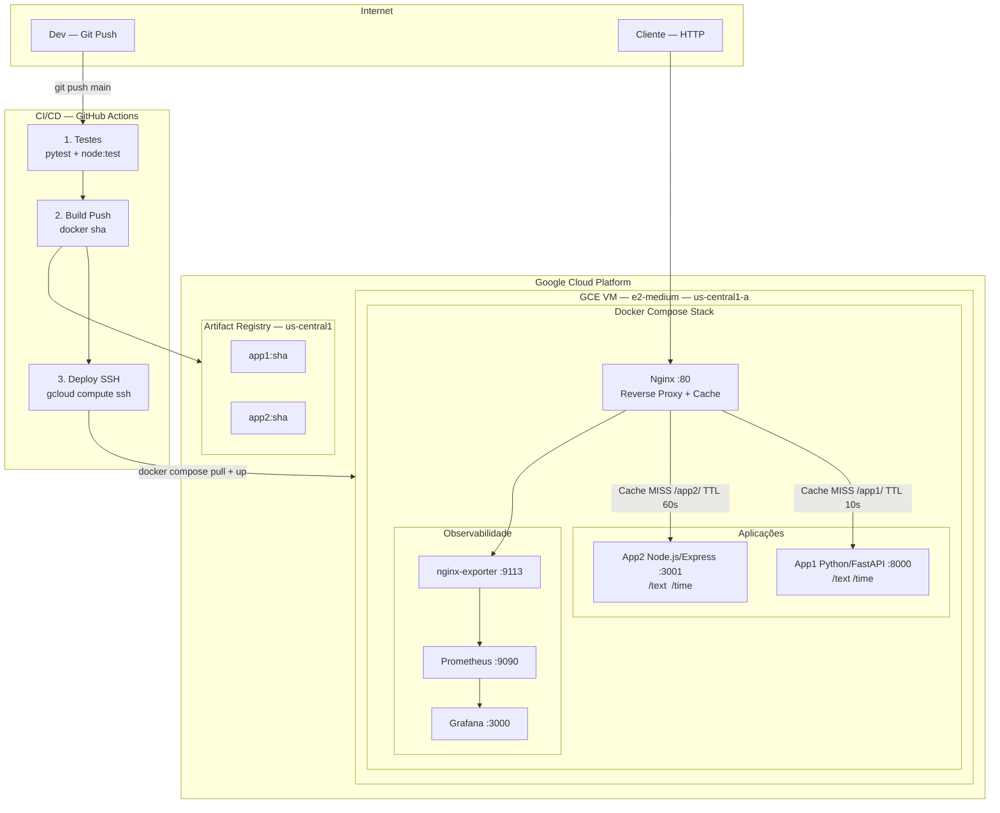
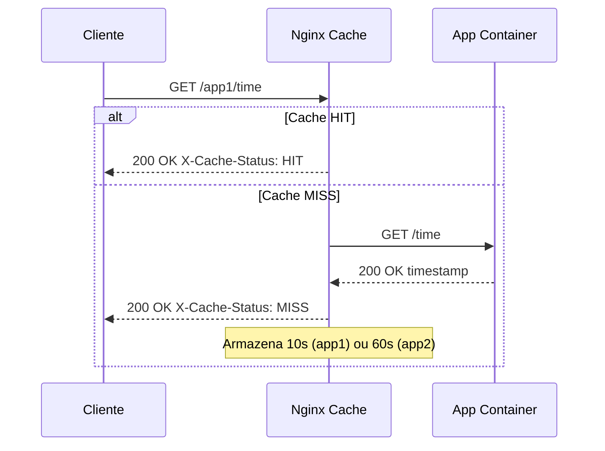
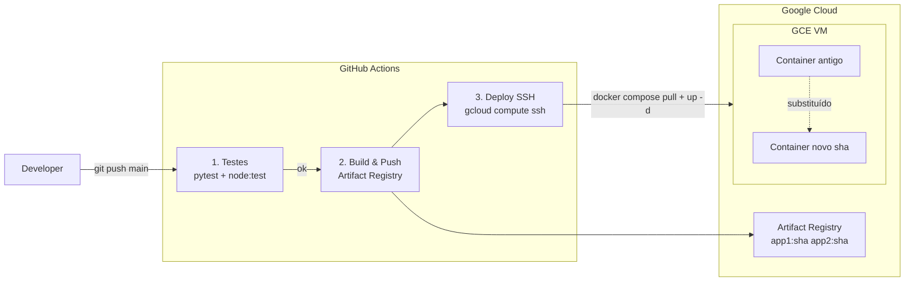

# Arquitetura da Infraestrutura

## Visão Geral

A infraestrutura roda na **Google Compute Engine (GCE)** na região `us-central1`.
Uma VM `e2-medium` executa toda a stack via **Docker Compose**:
Nginx (reverse proxy + cache), App1, App2, Prometheus e Grafana.
As imagens são armazenadas no **Artifact Registry** e o deploy é automatizado via **GitHub Actions**.

---

## Diagrama — Arquitetura GCE

---

## Diagrama — Fluxo de Requisição com Cache

---

## Diagrama — Fluxo CI/CD

> `docker compose up -d --remove-orphans` garante troca sem downtime perceptível.

---

## Componentes e Responsabilidades

| Componente | Tecnologia | Porta | Descrição |
|------------|-----------|-------|-----------|
| App 1 | Python FastAPI | 8000 | Rotas `/text` e `/time` |
| App 2 | Node.js Express | 3001 | Rotas `/text` e `/time` |
| Nginx proxy+cache | nginx:alpine | 80 | Reverse proxy com cache por rota |
| nginx-exporter | nginx-prometheus-exporter | 9113 | Exporta métricas do stub_status |
| Prometheus | prom/prometheus | 9090 | Coleta e armazena métricas |
| Grafana | grafana/grafana | 3000 | Dashboards (admin/admin) |

---

## Cache — Configuração

| App | Cache Zone | TTL | Header de resposta |
|-----|-----------|-----|--------------------|
| App 1 | app1_cache 10MB | **10 segundos** | `X-Cache-Status: HIT` ou `MISS` |
| App 2 | app2_cache 10MB | **60 segundos** | `X-Cache-Status: HIT` ou `MISS` |

---

## Análise e Sugestões de Melhoria

### Pontos fortes da arquitetura atual

- **GCE + Docker Compose** — setup simples, reproduzível, fácil de depurar
- **Startup script** — VM se auto-configura na criação, sem intervenção manual
- **Cloud Build** — build das imagens no cloud, sem Docker Desktop local
- **Cache no proxy** — sem alterar código das apps, TTLs diferentes por serviço
- **Imutabilidade de imagem** — cada deploy usa o SHA exato do commit (`:sha` + `:latest`)
- **Testes no CI** — bloqueia deploy se os testes falharem
- **Observabilidade** — Prometheus coleta métricas, Grafana exibe dashboards

### Sugestões de melhoria

| # | Melhoria | Justificativa |
|---|----------|---------------|
| 1 | GKE Autopilot | Escala automática de nós e pods, sem gestão de VMs |
| 2 | HTTPS + cert-manager | TLS automático via Let's Encrypt |
| 3 | Workload Identity Federation | Autenticação GCP sem chave JSON no CI |
| 4 | Redis como cache distribuído | Cache persiste entre restarts e compartilhado entre réplicas |
| 5 | Cloud Armor | WAF e proteção DDoS na frente da VM |
| 6 | Cloud CDN | Cache na borda global para conteúdo estático |
| 7 | Loki + Grafana | Centralizar logs junto às métricas |
| 8 | OpenTelemetry | Distributed tracing entre nginx e apps |
| 9 | Multi-region | VM em múltiplas regiões com Cloud DNS para failover global |
| 10 | Managed Instance Group | Auto-healing e escala horizontal automática da VM |
